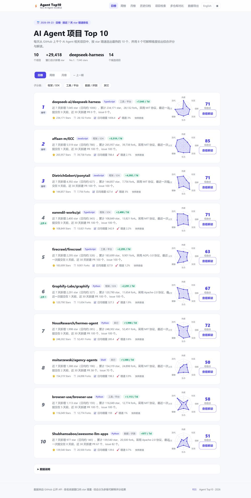
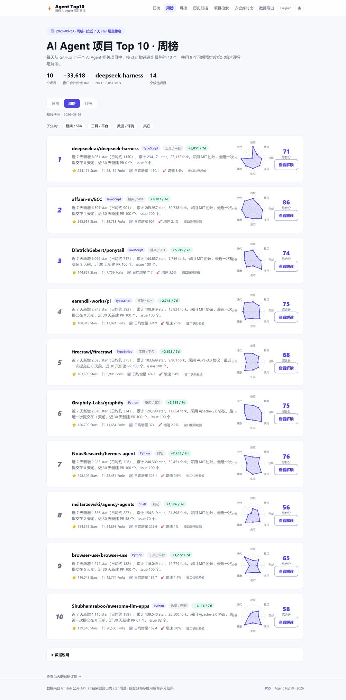
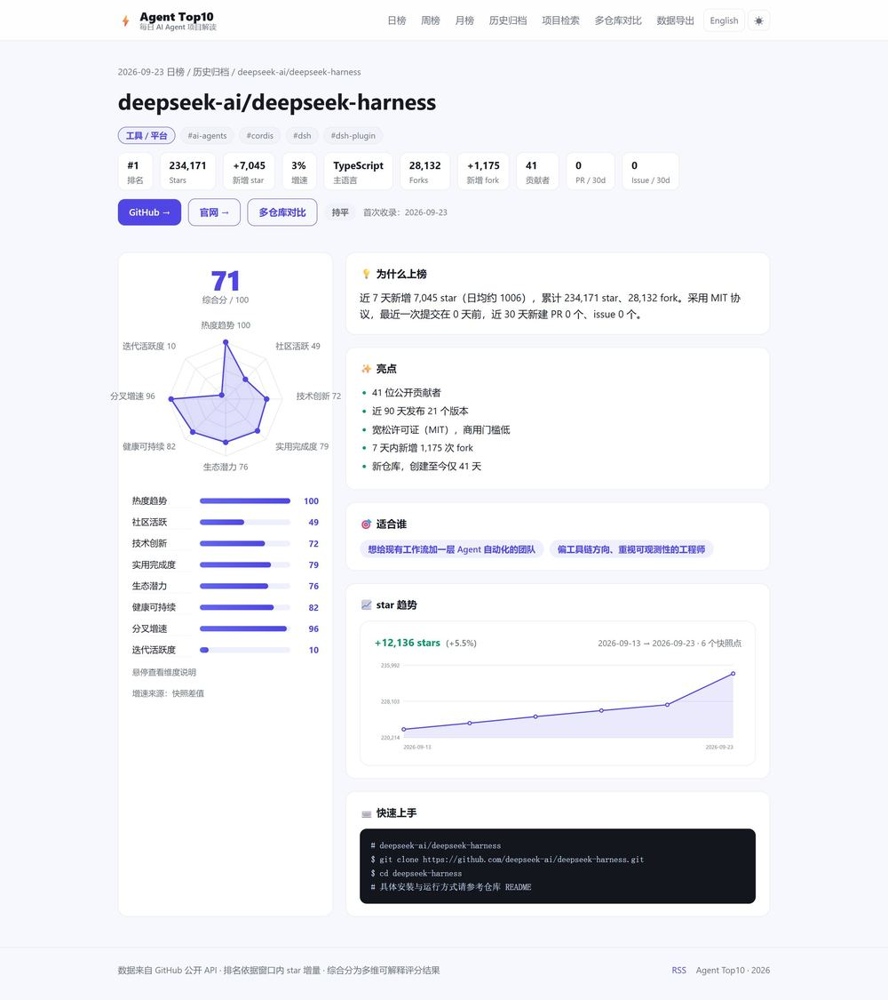
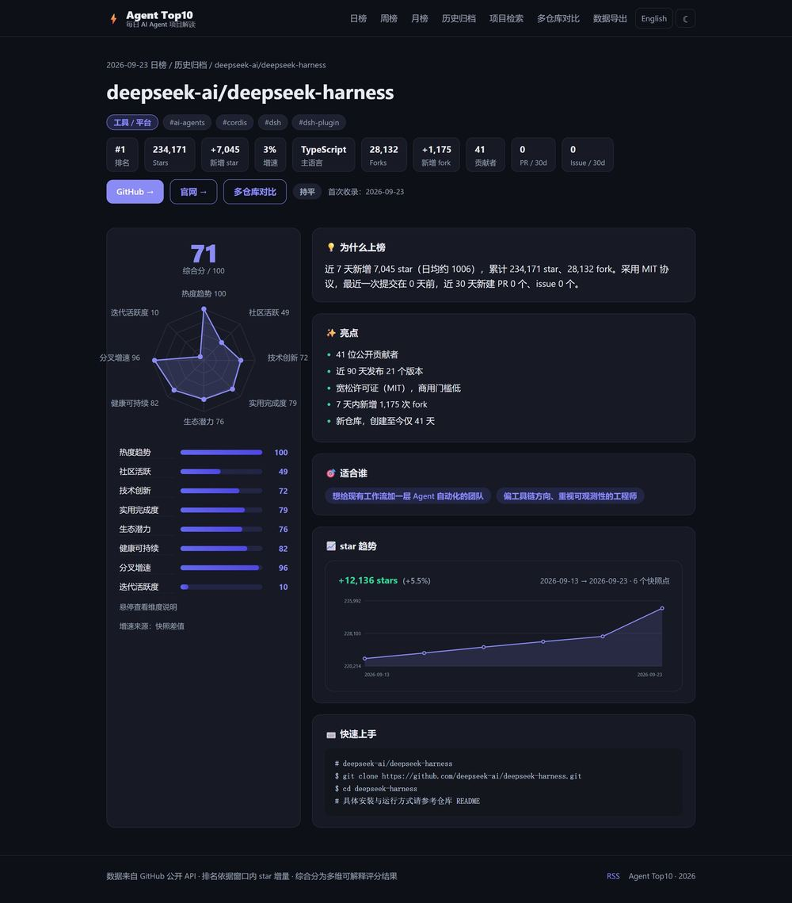
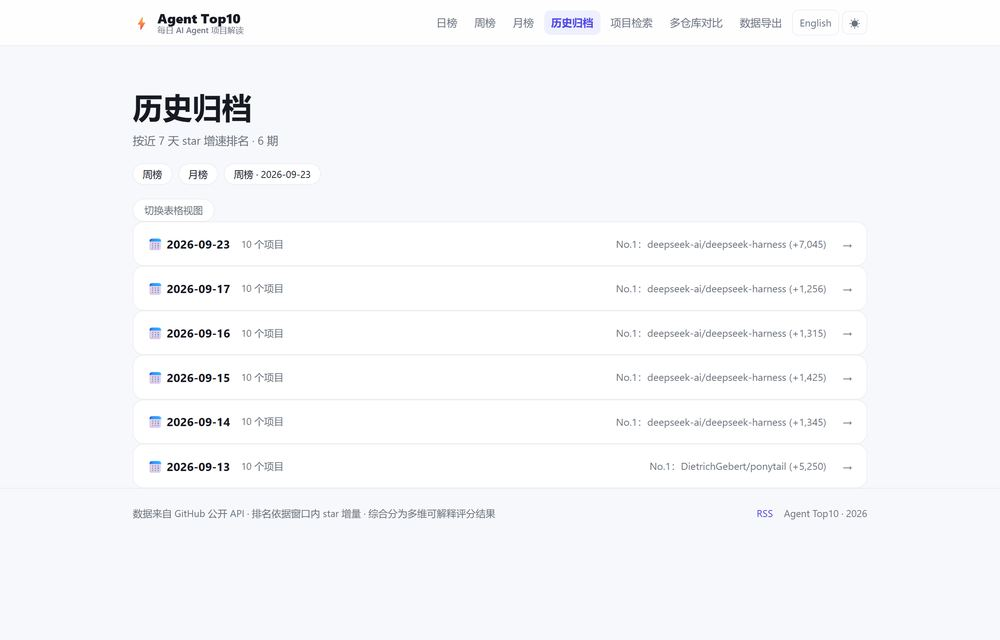
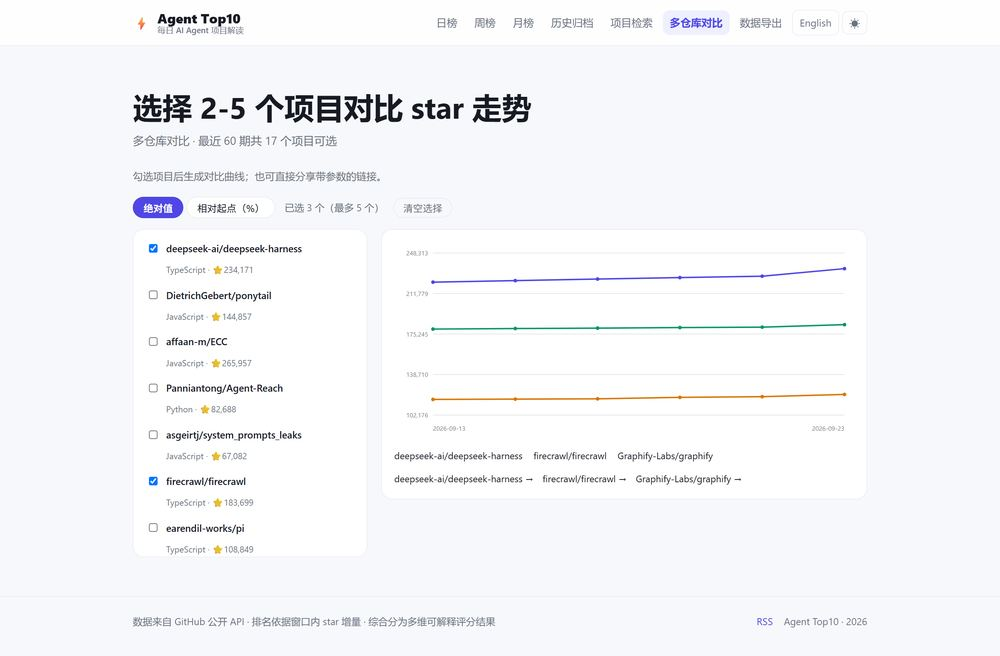
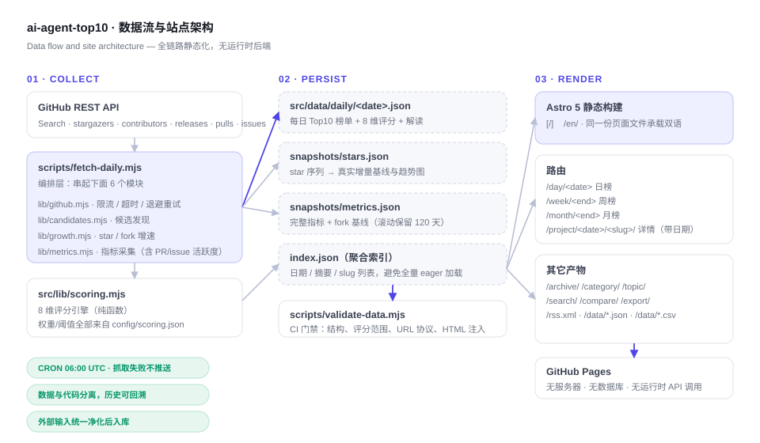

# ai-agent-top10

[](https://github.com/wjf1/ai-agent-top10/actions/workflows/daily.yml)

**每天从 GitHub 上按 star 增速选出最热的 10 个 AI Agent 项目，用 8 个可解释维度打分，并给出中英双语解读。**
纯静态站点：无后端、无数据库、无运行时 API 调用。

> **Daily top-10 AI Agent projects on GitHub, ranked by real star growth, scored across 8 explainable dimensions, with bilingual commentary.**
> Fully static: no server, no database, no runtime API calls.

🌐 站点 / Live site — <https://wjf1.github.io/ai-agent-top10/> · 🇬🇧 English — <https://wjf1.github.io/ai-agent-top10/en/>

---

## 目录 / Contents

| 中文 | English |
|---|---|
| [核心特性](#核心特性) | [Key features](#key-features) |
| [榜单截图](#榜单截图) | [Screenshots](#screenshots) |
| [数据流与架构](#数据流与架构) | [Architecture](#architecture) |
| [评分维度](#评分维度) | [Scoring dimensions](#scoring-dimensions) |
| [页面路由](#页面路由) | [Routes](#routes) |
| [本地开发](#本地开发) | [Local development](#local-development) |
| [配置项](#配置项) | [Configuration](#configuration) |
| [数据导出](#数据导出) | [Data export](#data-export) |
| [变更记录](#变更记录) | [Changelog](#changelog) |

---

## 核心特性

| 特性 | 说明 |
|---|---|
| **8 维可解释评分** | 热度趋势 / 社区活跃 / 技术创新 / 实用完成度 / 生态潜力 / 健康可持续 / 分叉增速 / 迭代活跃度。权重与阈值全部在 `config/scoring.json`，改配置即可调分，无需动代码。 |
| **日 / 周 / 月三种周期** | 周榜与月榜在构建期用历史快照聚合，不额外调用任何 API。历史不足一个完整窗口时会显式标注实际覆盖天数，**不做线性外推**。 |
| **真实增量优先** | star 增量优先取"约 7 天前那一期快照"的真实差值（零 API 成本）；快照缺失才回落到 stargazers 接口；超大仓库在事件流覆盖率不足时**直接跳过**，而不是把稀疏样本放大 20 倍。 |
| **趋势可视化** | 项目详情页展示 star 历史折线，数据来自每日快照序列。图表全部手写 SVG，不引入任何图表库：首页与详情页**零外部 JS**（仅约 1.7 KB 内联脚本），全站 CSS 8.8 KB，只有对比页加载 4.4 KB 脚本。 |
| **可交互雷达图** | 维度数量随数据自适应（早期数据 6 维、新数据 8 维共用同一组件），支持 hover 查看分值与该维度的计算口径。 |
| **按日期归档** | 项目详情页路由为 `/project/<date>/<slug>/`，每个项目每天一个独立页面，历史不会被覆盖；归档页可切换卡片 / 表格两种密度视图。 |
| **检索 / 分类 / 话题** | 关键字 + 语言 + 子分类（框架 / 工具 / 应用 / 数据评测）组合筛选；按 topic 聚合的标签页。无 JS 时表格依然完整可用，筛选是渐进增强。 |
| **多仓库对比** | 可选 2–5 个项目对比 star 走势，支持绝对值与"相对起点"两种模式，选择结果写进 URL 方便分享。 |
| **暗色模式** | 跟随系统偏好，首屏绘制前应用，无白屏闪烁；手动切换持久化到 localStorage。 |
| **开放数据** | `latest.json` / `latest.csv` / `history.csv` / `projects.json` / `rss.xml` 全部构建期静态生成，无需鉴权、无速率限制。 |
| **数据质量门禁** | 抓取与构建拆成两个 CI job，数据校验不通过就不提交、不部署；校验覆盖结构、评分范围、URL 协议与 HTML 注入。 |

### Key features

- **8 explainable scoring dimensions** — momentum, community, innovation, practicality, ecosystem, health, fork growth and iteration activity. Weights and thresholds live in `config/scoring.json`.
- **Daily / weekly / monthly boards** — weekly and monthly are aggregated at build time from historical snapshots, with **no extra API calls** and **no linear extrapolation** when history is short.
- **Real deltas first** — star gains come from actual snapshot deltas when available, fall back to the stargazers endpoint, and **skip** large repos whose event-stream coverage is too sparse instead of amplifying noise.
- **Trend charts & interactive radar** — hand-written SVG, no chart library, no client-side data fetching.
- **Date-scoped archive** — `/project/<date>/<slug>/` gives every project its own page per day; the archive offers card and table views.
- **Search, categories, topics, multi-repo compare, dark mode, open data endpoints** and a **CI data-quality gate** that blocks bad data from ever being committed.

---

## 榜单截图

### 日榜首页（浅色）：8 维雷达 + 分类标签 + 排名变化



### 周榜：构建期用快照聚合，标注基线与实际覆盖天数



### 项目详情：8 维雷达图（含数值与 hover 口径说明）+ star 趋势 + 指标卡



### 项目详情（暗色模式）



### 归档：每行链接到该日期自己的榜单，另有表格视图



### 多仓库对比：2–5 个项目、绝对值 / 相对起点两种模式，选择写进 URL



---

## 数据流与架构



采集 → 落盘 → 静态渲染，三段之间只通过 `src/data/` 下的 JSON 文件耦合。
抓取流水线按职责拆成 6 个模块（限流、候选、增速、指标、解读、持久化），
评分引擎 `src/lib/scoring.mjs` 是纯函数，被流水线与构建期聚合共同复用 —— 同一套口径，不会两处走偏。

```
config/scoring.json          # 单一事实来源：权重 / 阈值 / 关键词 / 分类规则
scripts/fetch-daily.mjs      # 编排层
scripts/lib/*.mjs            # 6 个采集模块 + schema 校验 + 持久化
src/lib/scoring.mjs          # 评分引擎（流水线 & 构建期共用）
src/lib/periods.ts           # 周榜 / 月榜聚合 + 趋势序列
src/lib/sanitize.mjs         # 外部输入净化（去标签 / 伪协议 / 不可见字符）
src/pages/[...lang]/…        # 中英双语共用同一份页面文件
```

### Architecture

Collection, persistence and rendering are coupled only through the JSON files under `src/data/`.
The pipeline is split into six single-purpose modules; the scoring engine is a pure function shared by the
pipeline and the build-time aggregation so both use exactly the same definitions.
Chinese and English pages are the same page files under an optional `[...lang]` route segment —
there is no duplicated `en/` tree.

---

## 评分维度

| # | 维度 | Dimension | 权重 | 口径摘要 |
|---|---|---|---|---|
| 1 | 热度趋势 | Momentum | 16% | 当轮与 7 天 star 增速在候选池中的分位 |
| 2 | 社区活跃 | Community | 12% | 贡献者规模、最近提交、近 90 天发版、开放 issue、仓库年龄 |
| 3 | 技术创新 | Innovation | 15% | 增速分位、新颖度、贡献者、前沿主题关键词命中 |
| 4 | 实用完成度 | Practicality | 15% | 宽松许可证、文档、话题标签完整度、示例与官网 |
| 5 | 生态潜力 | Ecosystem | 12% | star / fork 量级分位、组织账号、分发信号 |
| 6 | 健康可持续 | Health | 8% | 许可证、30 天内是否推送、issue/star 比、存活时长 |
| 7 | 分叉增速 | Fork growth | 10% | 窗口内 fork 增量与相对增速 —— fork 通常代表真的动手在复用 |
| 8 | 迭代活跃度 | Iteration activity | 12% | 近 30 天新建 PR / issue 数量的分位 |

> 某一维度缺少可信输入时，它会**从总分里剔除并按剩余维度重新归一化权重**，而不是按 0 计入 —— 所以早期 6 维数据与现在的 8 维数据都保持可比。
> 逐维口径说明也会直接显示在页面里（hover 雷达图顶点或维度名）。

### Scoring dimensions

Eight weighted dimensions as listed above; a dimension without trustworthy input is **dropped and the
remaining weights are renormalised** rather than counted as zero, which keeps early 6-dimension issues
comparable with today's 8-dimension ones.

---

## 页面路由

| 路由 | 说明 |
|---|---|
| `/` · `/en/` | 最新一期日榜（中 / 英） |
| `/day/<date>/` | 指定日期的日榜 |
| `/week/` · `/week/<endDate>/` | 最新 / 指定窗口的周榜 |
| `/month/` · `/month/<endDate>/` | 最新 / 指定窗口的月榜 |
| `/project/<date>/<slug>/` | 项目详情（**带日期**，历史不会被覆盖） |
| `/archive/` | 历史归档，卡片 / 表格切换 |
| `/category/<key>/` | 子分类榜：`framework` / `tool` / `app` / `data` / `other` |
| `/topic/<tag>/` | 话题标签聚合 |
| `/search/` | 项目检索（关键字 + 语言 + 分类） |
| `/compare/` | 多仓库 star 对比 |
| `/export/` | 数据导出说明 |
| `/rss.xml` · `/en/rss.xml` | RSS 订阅源 |
| `/data/latest.json` · `/data/latest.csv` · `/data/history.csv` · `/data/projects.json` | 开放数据 |

---

## 本地开发

```bash
npm install
npm run dev          # 本地开发服务器
npm run build        # 构建静态站点到 dist/
npm run preview      # 预览构建产物
npm run fetch        # 抓取当日数据（需要 GITHUB_TOKEN 或已登录的 gh CLI）
npm test             # 单元 / 回归测试
npm run validate     # 数据质量校验（CI 门禁）
npm run rescore      # 用指标快照离线重算历史评分（规则调整后使用）
npm run check        # 测试 + 校验 + 构建
```

抓取流水线支持几个便于调试的环境变量：

| 变量 | 作用 |
|---|---|
| `GITHUB_TOKEN` | 调用 GitHub API；缺省时回落到 `gh auth token` |
| `LLM_API_KEY` | 可选。配置 `interpretation.provider` 后用于生成解读，缺失时自动回落到规则化文案 |
| `MAX_CANDIDATES=3` | 只跑前 N 个候选，用于快速冒烟 |
| `DRY_RUN=1` | 跑完整流程但不写 `src/data/` |
| `DEBUG_REQUESTS=1` | 打印每次 API 请求的 URL 与耗时，便于定位限流 / 超时 |

### Local development

```bash
npm install && npm run dev
npm run check        # tests + data validation + build
```

`MAX_CANDIDATES`, `DRY_RUN` and `DEBUG_REQUESTS` are handy when iterating on the pipeline;
`LLM_API_KEY` is optional and the pipeline silently falls back to rule-based commentary without it.

---

## 配置项

所有评分与采集规则集中在 **`config/scoring.json`**：

- `dimensions[]` — 维度定义：`key` / `weight` / 中英名称 / 口径说明 / 公式参数。**加减权重、改阈值不需要动任何代码。**
- `window` — 日 / 周 / 月窗口天数与快照最大容忍龄期。
- `growth` — 快照基线容差、事件流覆盖率下限 `minCoverage`、外推上限 `maxExtrapolationFactor`、周增量合理性上限 `maxWeeklyGainRatio`。
- `api` — 单次运行调用预算、重试次数、退避基数、**请求超时**，以及单个候选的**墙钟上限**（`repoTimeoutMs`，任一环节挂住即跳过该仓库而不是拖死整轮；Node 原生 `fetch` 默认不超时，必须显式设置）。
- `metrics` — PR / issue 活跃度的翻页深度（决定计数上限，进而决定该维度的区分度）与统计窗口。
- `sanitize` — 各类外部输入的长度上限与允许的 URL 协议。
- `categories` — 子分类的正则规则。
- `interpretation` — 可选的 LLM 解读：provider / model / baseUrl / 读取密钥的环境变量名。

新增一个评分维度：在 `dimensions` 里加一项，并在 `src/lib/scoring.mjs` 的 `CALCULATORS` 中补一个同名函数即可。

---

## 数据导出

| 文件 | 内容 |
|---|---|
| `/data/latest.json` | 最新一期完整榜单（含评分、解读与全部指标字段） |
| `/data/latest.csv` | 最新一期的扁平常量表 |
| `/data/history.csv` | 全部历史的长表（每行 = 某期某项目） |
| `/data/projects.json` | 最近 90 期出现过的项目汇总：上榜次数、最好名次、逐期名次序列 |
| `/rss.xml` | 最近 30 期订阅源 |

全部为构建期静态产物，可直接 `curl` 或程序化抓取，无需鉴权、无速率限制。

> 早期期数只记录 6 个维度，`forksGrowth` / `activity` 两列自启用该功能后才有值。

---

## 变更记录

见 [CHANGELOG.md](CHANGELOG.md)。当前版本 **0.2.0**。

---

## 许可与数据来源

数据来自 GitHub 公开 REST API，仅做聚合与展示；仓库本身不存储任何 GitHub 令牌。
各项目的许可证以各自仓库为准，本站在详情页展示其 SPDX 标识。
